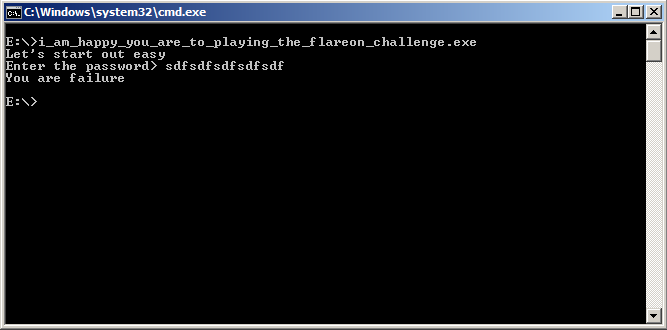
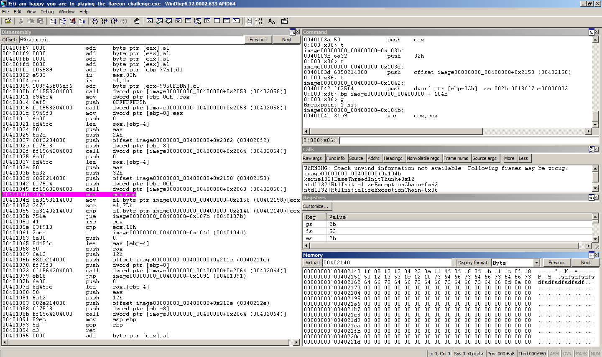

Challenge #1
------------

I was expecting this challenge to be no more involved than something like
searching for ascii-encoded text in the binary, or searching for ascii-encoded
text in a dump of the process memory. At first, I tried examining the binary
they sent me (Flare-On\_start\_2015.exe), but quickly realized it was a
self-extracting archive containing the real binary
(i\_am\_happy\_you\_are\_to\_playing\_the\_flareon\_challenge.exe). I extracted
it and continued. 

I didn't find anything that stood out in a memory dump, or in the binary
itself, so my next best guess was that the email was hidden with a simple
encryption scheme; probably XOR'd, since FLARE did something similar for the
first challenge last year. So I fired up Windbg.

Breaking on the program entry-point and single-stepping through it revealed a
loop doing a byte-by-byte xor on the user's input, and comparing it with a
string stored in the .data section. The key was a single byte, `0x7D`.

The breakpoint in the screenshot (hilighted in purple) happens right after the
call to `ReadFile()` that fetches user input.

I dumped the encrypted blob into vim and wrote a very short program to decrypt
it.

The decoded email address was: "bunny\_sl0pe@flare-on.com".

Solution Code
-------------

    #include <stdio.h>
    
    char* string = "\x1f\x08\x13\x13\x04\x22\x0e\x11\x4d\x0d\x18\x3d\x1b\x11\x1c\x0f\x18\x50\x12\x13\x53\x1e\x12\x10";
    int size = 24;
    
    int main(){
        for(int i = 0; i < size; i++){
            printf("%c", string[i]^0x7D);
        }
        printf("\n");
    }
