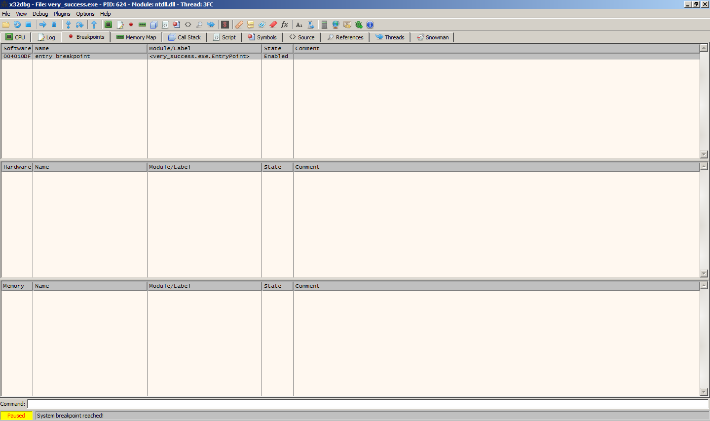

Challenge 2
-----------

It might be worth noting that before attempting this year's Flare-On, my
experience with assembly-language programming was limited to the MIPS R3000
kind of stuff you learn at school. Finishing this challenge (and the first for
that matter) took forever, mostly because I was reading through Intel's
7-volume x86 reference manual every time I had a question about an instruction
I wasn't familiar with (which was pretty much every instruction). I also wasn't
very familiar with my options as far as debuggers and disassemblers. Between
the first challenge and the second, I found a [new
debugger](http://x64dbg.com/) that was free, open source, and looked pretty
slick, and I decided to try using it for this next challenge.

FLARE's email reads:

    Congrats! I've attached the next challenge for your reversing pleasure. The password to this zip archive is "flare".
    
    This challenge looks a lot like the last one so hopefully you'll knock this one out too, Good luck!
    
    -FLARE

Attached is an archive containing an executable named `very\_success.exe` that
*file* reports as being a `PE32 executable for MS Windows (console) Intel 80386
32-bit`.

This probably means that we can expect another XOR. Maybe this time it'll be a
multi-byte key (maybe a one-time pad) or have a bunch of other math thrown into
the mix. Let's bring up the debugger, and break on the entry-point. Then we'll
step through until we find where the magic starts.

As you can see, x64dbg was nice enough to set a breakpoint for us at the
entry-point, and even labeled the address for us. The very first instruction is
a call to another function at *0x00401000*

During the call, we see the same kind of setup as in the last challenge. The
function gets handles to *stdin* and *stdout*, prints a message to the
terminal, and then reads user input which it saves to the *.data* section at
*0x00402159*. Then another function at *0x00401084* is called, and is passed a
pointer to the text we just entered. Ah, here we go. It looks like this is
where the magic happens. We see a bunch of *xor*, *rol*, *scas*, *xchg*, etc...

The first interesting thing that happens is that *0x25* is moved to *ecx*, and
then compared with *ss:[ebp+10]*. If the result indicates "less than", the
function jumps straight to the end, no questions asked, do not pass go, do not
collect $200. After running this function a few times with different input, I
realized that *ss:[ebp+10]* is the length of the string that you enter. Plainly
put, the function doesn't do anything unless your input is 37 characters or
greater (which probably means that this is the length of our email address).
Using x64dbg makes it very easy to patch this particular line so that we can
just enter whatever we like, but it's more fun to mash the keyboard :D

Continuing on, things get messy. It took me hours to figure out exactly what
was going on (see the note at the top of the page), but eventually I made sense
of the algorithm at work. I'd explain every instruction here, but you'd
probably be better served by a reference manual. Instead, I'll just tell you
that the *adc* always adds a carry, since *eflags* is pushed to the stack right
after *0x01* is loaded into it, and popped off the stack right before the
*adc*. You should also be aware that *bx* acts like an accumulator, summing the
ciphered characters over every iteration. Lastly, note that the stored
ciphertext that our input is being compared against is actually stored in the
*.text* section, and that we need to move backward in memory to iterate over
it, not forward.

So what I needed to do was take this algorithm, and use it to solve for the
correct input to match the ciphertext. In the forward direction, the algorithm
looks like:

    (x_i ^ 0xC7) + (0x01 << (total_i ^ 0x03)) + 0x01 == ciphertext_i

* *i* is the index of the current character
* *x_i* is the current input character to be ciphered
* *total_i* is the least significant byte of the sum total of each ciphered character, up to *i*
* *ciphertext_i* is the current byte of stored ciphertext that the input should match after the algorithm is finished

Since our objective is to solve for *x_i* at every iteration, we'll re-arrange the function:

    (ciphertext_i - (0x01 << (total_i & 0x03)) - 0x01) ^ 0xC7 == x_i

I dumped the stored ciphertext, reversed the byte order, and wrote a few lines
of C to run the algorithm against it. 

Voila. The decoded email address is: "a\_Little\_b1t\_harder\_plez@flare-on.com"

Solution Code
-------------

    #include <stdio.h>

    char* ciphertext = "\x00\xA8\x9A\x90\xB3\xB6\xBC\xB4\xAB\x9D\xAE\xF9\xB8\x9D\xB8\xAF\xBA\xA5\xA5\xBA\x9A\xBC\xB0\xA7\xC0\x8A\xAA\xAE\xAF\xBA\xA4\xEC\xAA\xAE\xEB\xAD\xAA\xAF";

    int main(){
        int total = 0;
        for(int i = 1; i < 38; i++){
            total += ciphertext[i-1];
            printf("%c", (ciphertext[i] - (0x01 << (total & 0x03)) - 0x01) ^ 0xC7);
        }
        printf("\n");
    }

