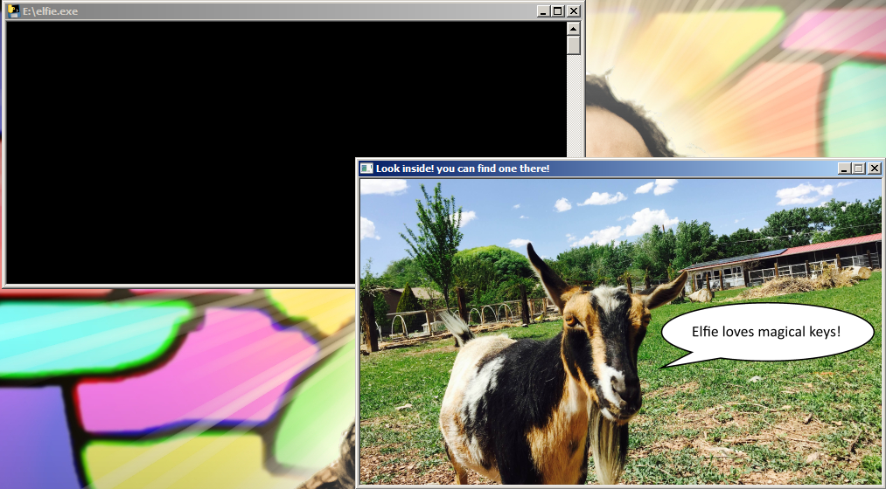

Challenge 3
-----------

Flare-On's next email to me read:

    Great job, you're really knocking these out! Here's the next binary for your goaty enjoyment. The password to the zip archive is "flare" again.
    
    Keep up the good work, and good luck!
    
    -FLARE

Attached to the email was an archive containing another 32-bit PE, called "elfie".

I've omitted this from the last two writeups, but you should know that I start
every challenge by checking the obvious. First, I check for ASCII-encoded
strings in the binary that I'm examining. Next, I run the executable and play
with the user-interface, if there is one. Next, I look at the PE header, and
examine metadata, resources, etc... Finally, I dump process memory, and do the
same check for strings that I do with the original binary. I don't usually
expect those to yield the solution to the challenge. They're mostly to see if
the challenge designer messed up, and to learn more (and find hints) about the
program I'm working with. 

It just so happens that for this challenge, while examining a dump of the
process memory, I found the email address sitting there in plaintext.

I'm not sure if the challenge was meant to be solved this way, but given the
large amount of Python code I found in the binary, I'm guessing that it wasn't.
All in all, this one took about 10 minutes to complete.

Solution Code
-------------

    strings elfie.DMP | less
