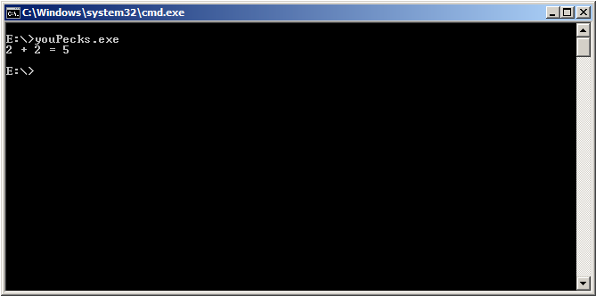

Challenge 4
-----------

Flare-On's next email read:

    Congrats! I've attached the next challenge for your reversing pleasure. The password to this zip archive is "flare".

    This challenge looks a lot like the last one so hopefully you'll knock this one out too, Good luck!

    -FLARE

Attached was a file named "very\_success". *file* reports a `PE32 executable
for MS Windows (console) Intel 80386 32-bit`. There is a *UPX0* section and a
*UPX1* section in this binary, so it's probably safe to assume that it's been
packed with UPX.

I unpacked it with `upx -d youPecks.exe`, and ran it.

Hm... that's strange. This is where I got to work reverse-engineering.

Unfortunately, this is where I messed up. Instead of running the binary once
before unpacking it, I just unpacked it immediately and got to work
reverse-engineering. I ended up working on it off and on over the next week and
made progress, but never ended up solving it. After reading the solution that
FireEye posted on their blog, I realized why; the unpacking stub that I threw
away with `upx -d` contained code that would modify the binary to make it work
correctly.

This is where this year's attempt ended. Oh well :(
All in all, I had fun and learned a lot. Hopefully I make it further next year!
